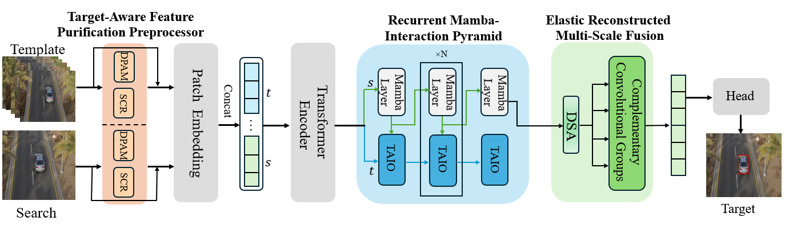

  Single-object tracking is a fundamental enabling
technology in the field of remote sensing observation. It plays
a crucial role in tasks such as unmanned aerial vehicle route
surveillance and maritime vessel trajectory prediction. However,
because of challenges such as the weak discriminative power
of target features, interference from complex environments, and
frequent viewpoint changes, existing trackers often suffer from
insufficient temporal modeling capabilities and low computa
tional efficiency, which limit their practical deployment. To
address these challenges, we propose TSTrack, a novel lightweight
single-object tracking framework that integrates Transformer
and Mamba-based spatiotemporal modeling. First, we propose
the target-aware feature purification preprocessor (TAFPP) ,
designed to dynamically enhance target representation through
a synergistic combination of the dynamic position acuity module
(DPAM) and spectral channel recalibrator (SCR). Second, we
introduce the recurrent Mamba interaction pyramid (RM-IP)
to replace traditional recurrent neural network-based struc
tures, leveraging a state-space model for efficient and expressive
temporal modeling with significantly reduced parameter over
head. Finally, we propose the elastic reconstructive multi-scale
fusion (ERMSF) module, which adopts a four-branch parallel
architecture to achieve effective multiscale feature fusion and
dynamic shape adaptation, thereby enhancing robustness against
target deformations and scale variations. Extensive experiments
conducted on benchmark datasets, including LaSOT, Track
ingNet, and GOT-10k, demonstrate the effectiveness of TSTrack.
The results show that TSTrack achieves a superior tracking
accuracy while maintaining a lightweight design, significantly
outperforming existing state-of-the-art methods.

### Simple architecture

SUTrack unifies different modalities into a unified representation and trains a Transformer encoder.



#### Efficient RGB-based Tracking:
| Tracker          | LaSOT (AUC) | GOT-10K (AO) | TrackingNet (AUC) | CPU Speed (FPS) | 
|------------------|-------------|--------------|-------------------|-----------------|
| **TSTrack**      | **67.9**    | **70.5**     | **82.1**          | 28              | 
| **TSTrack-Lite** | **67.3**    | **70.0**     | **81.6**          | 39              | 
| AsymTrack-B      | 64.7        | 67.7         | 80.0              | 38              | 
| HiT              | 64.6        | 64.0         | 80.0              | 33              | 
| MixformerV2-S    | 60.6        | -            | 75.8              | 30              | 
| HCAT             | 59.3        | 65.1         | 76.6              | 45              | 
| FEAR             | 53.5        | 61.9         | -                 | 60              | 

## Install the environment
```
conda create -n sutrack python=3.8
conda activate sutrack
bash install.sh
```
* Add the project path to environment variables
```
export PYTHONPATH=<absolute_path_of_SUTrack>:$PYTHONPATH
```

## Data Preparation
Put the tracking datasets in [./data](data). It should look like:

For RGB tracking:
   ```
   ${SUTrack_ROOT}
    -- data
        -- lasot
            |-- airplane
            |-- basketball
            |-- bear
            ...
        -- got10k
            |-- test
            |-- train
            |-- val
        -- coco
            |-- annotations
            |-- images
        -- trackingnet
            |-- TRAIN_0
            |-- TRAIN_1
            ...
            |-- TRAIN_11
            |-- TEST
   ```
## Set project paths
Run the following command to set paths for this project
```
python tracking/create_default_local_file.py --workspace_dir . --data_dir ./data --save_dir .
```
### Train SUTrack
The pretrained backbone models can be downloaded here [[Google Drive]](https://drive.google.com/drive/folders/1Ut0qrM5mwIw4Qhu-sOnzm2QCAOE7cTYH?usp=sharing)[[Baidu Drive]](https://pan.baidu.com/s/1pMc3SzshxhLTGTF99GrvMg?pwd=6wtc).
Put the pretrained models in [./pretrained](pretrained), it should be like:

   ```
   ${SUTrack_ROOT}
    -- pretrained
        -- itpn
            |-- fast_itpn_tiny_1600e_1k.pt
```
Then, run the following command:
```
python -m torch.distributed.launch --nproc_per_node 4 lib/train/run_training.py --script sutrack --config sutrack_b224 --save_dir .
```
(Optionally) Debugging training with a single GPU
```
python tracking/train.py --script sutrack --config sutrack_b224 --save_dir . --mode single
```
## Test and evaluate on benchmarks
### SUTrack for RGB-based Tracking
- LaSOT
```
python tracking/test.py sutrack sutrack_b224 --dataset lasot --threads 2
python tracking/analysis_results.py # need to modify tracker configs and names
```
- GOT10K-test
```
python tracking/test.py sutrack sutrack_b224 --dataset got10k_test --threads 2
python lib/test/utils/transform_got10k.py --tracker_name sutrack --cfg_name sutrack_b224
```
- TrackingNet
```
python tracking/test.py sutrack sutrack_b224 --dataset trackingnet --threads 2
python lib/test/utils/transform_trackingnet.py --tracker_name sutrack --cfg_name sutrack_b224
```
## Acknowledgments
This work is based on our previous work [SUTrack](https://github.com/chenxin-dlut/SUTrack/tree/main), which is a unified multi-modal tracker.
Our experimental setup is consistent with the RGB-based part of SUTrack, and you can refer to the relevant experimental configurations of SUTrack.
If you have any questions, please leave them in the github comments.
